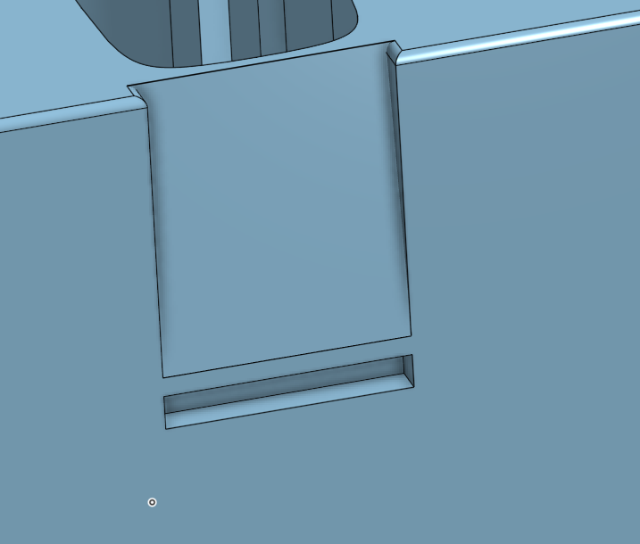

# May 5th: Researched Parts and started BOM

I am researching the parts required to build the drone. [This](https://oscarliang.com/) website has been a great help and has helped me finalise my parts list. The BOM will soon be added as a seperate file.

**Total time spent: 3h**

# May 6th: Made a Wiring Diagram

Now that I have the parts list, I started researching the datasheets of the individual parts. Luckily, most of the parts had a wiring diagram attached to the listing. Using these diagrams, I recreated them in KiCad and made up a schematic, with custom symbols for each part, for the drone. This should make it easier to wire the drone up later on.

You might notice that there are some unused pins. This is because I fully copied over the wiring diagrams from the parts, and some of them had more pins than I needed. I will leave them there in case someone wants to use the same parts but with different wiring and needs the symbols.

I was also looking at alternative parts, and one caught my eye: the [SPEEDYBEE F405 V3 Stack](https://www.fpvfaster.com.au/products/speedybee-f405-v3-flight-controller-bls-50a-esc-stack-30-5x30-5mm?variant=40142631862354). 

It has a lot of similar features to the XILO Stax V2 I was planning to use, so I will be looking into it more. It is also cheaper, so I might end up using it instead. Tomorrow, I will try to finish the 3D model of the drone case and submit the project as the other 3D prints require precise measurements.

**Total time spent: 4h**

# May 7th: Started 3D Model
To start with, I did a lot more research on the parts, and ended up with a configuration that makes the most use of the budget, without over-spending on any one part. Through this, I was able to reduce the cost of the drone by ~$71 AUD.

Moving on, I started the 3D models. Since I am using a new frame, I had to spend way too much time looking for dimensions. Finally however, I found the dimensions of the frame and started modelling it in [OnShape](https://www.onshape.com/). While I am decent with CAD, I am not the best, so I decided to *not* model the frame itself, but rather just the case that will hold all the parts. The criteria I had for this case were:
- It should be able to hold all the parts required to film securely
- It should be compact
- It should be easy to print
- It should be aesthetically pleasing
- All parts must sit flush (OCD)
- It should *click* together, so no screws are required

With that decided, I finalised what I wanted to be able to fit in the case:
- GoPro Hero 13
- 6S LiPo pack
- 5" props (2 spaces, one for CW and one for ACW)
- Drone (duh)

The first step was to sketch out the bottom in 2D, and I ended up with this, using the image on the left as a reference:

Here, the two skinny rectangles on either side are the prop mounts (it will be more clear in the finished model), the rectangle to the left is the GoPro mount, and the rectangle on the right is the 6S LiPo pack mount. The rest is the drone itself, which will be mounted in the middle. As is apparent, I tried to keep everything tight, and therefore had to think outside the box (literally) to fit everything in. 

The next challenge to tackle was the click. Since I am not using screws, I had to make sure that the case would hold everything securely. To do this, I decided to use a click mechanism, where the top and bottom of the case would click together. This is done by having a lip on the top and a groove on the bottom, which will hold everything in place. To start with, I had this:

However, I quickly realised that this would not work, as the filament would not bend enough for the groove to hold the lip securely. So, I redesigned it to slope, which would allow the filament to bend more easily. This is what I ended up with, with a slope leading to the groove:

I finished the bottom part of the case with filets to make it look nicer. I did *not* filet the bottom as it will lead to a harder print and won't have enough of an aesthetic impact to justify the harder and more complicated print. The final model of the bottom part looks like this:

As you can see, the sides are exposed. This is where the props will fit. You will be able to slip in two 5 inch props on either side. This, along with the top of the case clicking into the bottom, should hold everything securely in place.

Moving on to the top part, I wanted something simple and professional to match the aesthetic so far. Therefore, I ended up going with a simple box design, with the lip on the inside to latch onto the groove on the bottom. I'll let the design speak for itself:

I added filets to the text at the top as well, to match the round-ish aesthetic of the bottom part. Overall I am very happy with the design so far, and I think it will work well. The next step was to model the motor guards and the GoPro mount. That was not that hard, and I will not bore you with the details. All of these models are attached to the 3D Models folder in the repository.

**Total time spent: 6h**

## May 8th: Resubmitting with more Images
As @Cyao pointed out, I did not have enough images in my repo, so I will be adding more images to the repo along with more thorough explanations of design choices of the carrying case.

### 1. Case Design Explanation
Something that might be better explained with the following image (excusing my horrible drawing skills):

The case is designed to hold *everything* you would take on a field trip. The hardest part to cater for was the Props, as they are quite long and would not fit in a normal case. Therefore, I had to design the case to hold them on the sides, which is why the case is so tall. They are 5 inch props (5 in diameter), so I decided to make a similar mount as to the motor, which is why there is a protrusion on the side. Rest everything should fit in as illustrated in the image above.

### 2. Latch Mechanism Explanation
The satisfying click that I was craving was achieved by having a lip on the top part of the case and a groove on the bottom part. As mentioned above, I started with a flat cross-section, as shown in Fig. 1:

However, I quickly realised that this would not work, as the filament would not bend enough for the lip to be able to slide down into the groove. Therefore, I redesigned it to have a slope, which would allow the filament to bend more easily. This is shown in Fig. 2

**Total time spent: 2h**

# May 9th: Made more 3D Models
At @Cyao's suggestion, I made more 3D models of the drone. These are proof of concept models, and are not the final models. They are designed to show how the drone will look like when it is finished. The dimensions will be perfected once I have the parts at hand, but for now, these models should give a good idea of how the drone will look like. All pics for them can be found in the [img folder](img/poc/).

**Total time spent: 3h**

# May 10th: Modelled and Sculpted the Drone
Since @Cyao was insistent on having a 3D model of the drone, I decided to model it in Blender. It was a long process, but I am happy with the result. I chose Blender over OnShape as I am more comfortable with it, and thought it will allow better looking model. This is the result.

Also, side note, I imported it into OnShape as I like the default texturing better than Blender's static grey.

I also added all of these images in README.md, so you can see them there as well.

**Total time spent: 7h**