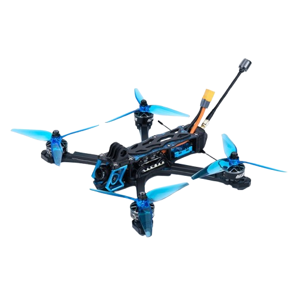
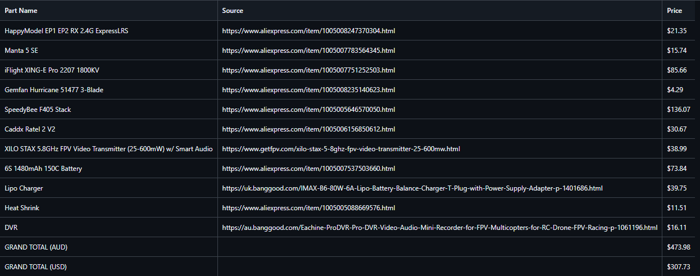

# FPV-Drone
There are tons of FPV drones out there, but I wanted to make one that is different. This drone will be able to switch between FPV and Cinema mode with the flick of a switch. When filming, the drone will be able to carry a GoPro Hero 13, and when flying FPV, it will be using the smaller camera along with on-board DVR. This will allow the drone to be used both to experience the thrill of FPV flying and to capture beautiful cinematic footage without having to carry two separate drones.

  

Since there is no CAD model of the drone, I have attached a picture of the look that I am going for. I will replace this with the finished build once it is done.

# BOM
The BOM is available in the [BOM.csv](BOM.csv) file. It contains all the parts required to build the drone, along with links to where they can be purchased. On a glance:

The total cost currently comes out to ~$300 USD, bear in mind that this is without the GoPro Hero 13 and other things like FPV goggles and remote controller. It also does not include the cost of the 3D printed parts or the shipping costs. The cost of the drone will vary depending on where you live and where you buy the parts from.

# Firmware
For the firmware, I will be using the tried and tested [BetaFlight](https://betaflight.com/) firmware and will be heavily fine tuning it. This firmware is widely used in the FPV community and has a lot of features that will be useful for my drone. The firmware files will be added to the repository once the drone is built and tested as I can't test and tune the firmware without the drone being built.

# 3D Printed Parts
The 3D printed parts are all under the 3D Models folder in the repository. It contains the STL files for a carrying case, the GoPro mount, and the motor guards. Other parts that require finer measurements will be added once the drone is built and tested. The 3D printed parts are designed to be printed with standard PLA filament, but there might be some TPU parts in the future for added flexibility and durability.

# Credits
The image of the drone is from [MantisFPV](mantisfpv.com.au).

I would also like to thank @Mikuel for [this](https://www.aos-rc.com/aos-labs) link which explained drone motors to me.