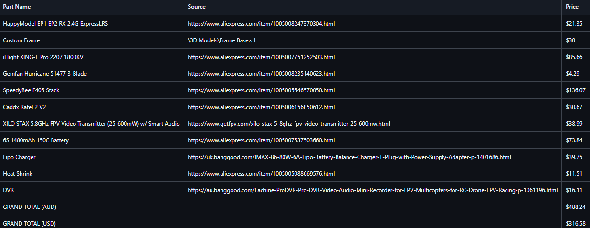

# Ghast Drone
While playing Minecraft, I entered the Ghast while in spectator mode, and wondered what it would be like to fly in it IRL. Therefore I designed the following project.

  

I have attached the picture of the look that I am going for. I will replace this with the finished build once it is done.

# BOM
The BOM is available in the [BOM.csv](BOM.csv) file. It contains all the parts required to build the drone, along with links to where they can be purchased. On a glance:

The total cost currently comes out to ~$300 USD, bear in mind that this is without the cost of the 3D printed parts or the shipping costs. The cost of the drone parts will vary depending on where you live and where you buy the parts from.

# Firmware
For the firmware, I will be using the tried and tested [BetaFlight](https://betaflight.com/) firmware. This firmware is widely used in the FPV community and has a lot of features that will be useful for my drone. I should be able to customise it to give it the "floaty" feel of the Ghast.

# 3D Printed Parts
The 3D printed parts are all under the 3D Models folder in the repository. It contains the STL files for a carrying case, a GoPro mount, and the Ghast body and tentacles. The 3D printed parts are all designed to be printed with standard PLA filament.

# 3D Model

The 3D model of the Ghast is available in the [3D Models](/3D%20Models/Proof%20of%20Concept/).

# Frame Design

# Credits
I would like to thank @Mikuel for [this](https://www.aos-rc.com/aos-labs) link which explained drone motors to me.
